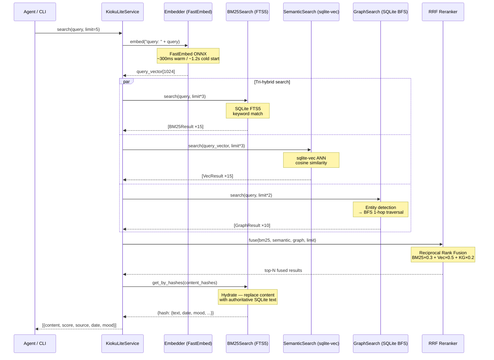

# Search Architecture — How It Works

> Last updated: 2026-04-02 (v0.1.29-dev)

## Overview

`search` is the retrieval pipeline of kioku-lite — tri-hybrid search combining BM25, vector similarity, and knowledge graph traversal, with no LLM call in the search path.

## Pipeline

```
kioku-lite search "What has Alice been up to?" --entities "Alice" --limit 5
  ↓
┌──────────────────────────────────────────────────┐
│  search(query, entities, limit, include_hist)   │
│                                                  │
│  1. Embed Query                                  │
│     └── embed("query: " + text)                 │
│         → 1024-dim query vector                  │
│                                                  │
│  2. Tri-Hybrid Search (parallel)                 │
│     ├── BM25 (SQLite FTS5)                       │
│     │   keywords extracted from query            │
│     ├── Semantic (sqlite-vec)                    │
│     │   cosine similarity → query vector         │
│     └── Graph (PPR or BFS)                       │
│         ├─ if --entities: PPR seed on entities   │
│         │  (entity-focused, multi-hop, weighted) │
│         └─ else: BFS 1-hop (simple, fast)        │
│         exclude_historical = not include_hist    │
│                                                  │
│  3. RRF Reranking                                │
│     └── Reciprocal Rank Fusion                   │
│         weights: BM25×0.3 + Vec×0.5 + KG×0.2     │
│                                                  │
│  4. Deduplicate + Hydrate                        │
│     └── Fetch full text from SQLite              │
└──────────────────────────────────────────────────┘
  ↓
[{content, score, source, date, mood, content_hash}, ...]
```

## Sequence Diagram



## Response Structure

```json
{
  "query": "What has Alice been up to?",
  "count": 3,
  "results": [
    {
      "content": "Had coffee with Alice. Discussed the Kioku release plan.",
      "score": 0.032,
      "source": "graph",
      "date": "2026-02-27",
      "mood": "excited",
      "content_hash": "abc123..."
    },
    {
      "content": "Meeting with Alice about the Kioku project. Very productive.",
      "score": 0.018,
      "source": "vector",
      "date": "2026-02-27",
      "mood": "work",
      "content_hash": "def456..."
    }
  ]
}
```

## Component Roles

### BM25 (SQLite FTS5)
- **Strength:** Exact keyword / entity name matching
- **Query format:** Entity names are wrapped in `"..."` to avoid FTS5 syntax errors
- **Weight in RRF:** 0.30
- **Observed contribution:** ~30% — especially strong with proper nouns and technical terms

### Semantic (sqlite-vec)
- **Strength:** Fuzzy semantics, synonyms, cross-language
- **Model:** `intfloat/multilingual-e5-large` (E5 `query:` prefix)
- **ANN method:** Cosine similarity scan (sqlite-vec)
- **Weight in RRF:** 0.50
- **Observed contribution:** ~50% — dominant for conceptual queries

### Graph (PPR or BFS)
- **Activation:** 
  - `--entities` provided → PPR (Personalized PageRank)
  - No `--entities` → BFS 1-hop (default)
- **PPR (Entity-Focused):**
  - Seed on provided entities, walk graph with damping=0.85
  - Multi-hop associative recall, weights by relevance to seeds
  - E.g., "who does Alice work with?" → ranks co-workers by association strength
- **BFS (Simple):**
  - Direct neighbors in kg_edges
  - Fast, suitable for single-entity recall
- **Temporal:** 
  - Excludes `valid_until < today` edges by default
  - `--include-historical` flag includes superseded facts
- **Weight in RRF:** 0.20
- **Observed contribution:** ~20% — critical for person/project queries

## RRF Reranking

Reciprocal Rank Fusion formula:

```
score(d) = Σ  weight_leg × 1 / (k + rank_in_leg(d))
           legs
```

Where `k = 60` (standard RRF constant).

Results are merged, deduplicated by `content_hash`, then sorted by fused score descending.

## Latency Breakdown (10-query benchmark)

| Phase | Time | Notes |
|---|---|---|
| FastEmbed embed query | ~300ms (warm) / ~1,200ms (cold) | ONNX model load penalty |
| BM25 FTS5 search | ~5ms | In-process SQLite |
| sqlite-vec ANN | ~50ms | In-process |
| GraphSearch BFS | ~10ms | In-process SQLite |
| RRF + hydrate | ~20ms | In-process |
| **Total (warm)** | **~400ms** | Long-running service |
| **Total (cold CLI)** | **~1,200ms** | Subprocess + model load |

> **Note:** Cold start penalty (~800ms) comes from subprocess Python initialization and ONNX model loading. With a long-running service (e.g. MCP server), warm latency is ~400ms.

## Real-World Performance (2026-02-27 Benchmark)

Benchmark comparing kioku-lite (personal, zero Docker) against the full enterprise stack (ChromaDB + FalkorDB + Ollama) — same corpus of 20 docs, 10 queries, same model:

| Metric | kioku-lite | Enterprise stack |
|---|---|---|
| Avg search latency | **1,210ms** | 9,176ms (throttled) / ~2,500ms normal |
| Precision@3 | **0.60** | 0.60 |
| Recall@5 | 0.89 | **1.04** |
| Queries won | **6/10** | 2/10 |

**kioku-lite wins:** Technical term queries (debug, merge PR, deploy) — BM25 FTS5 is more precise for exact keyword matches.
**Enterprise stack wins:** Complex semantic + multi-entity queries — ChromaDB ANN + FalkorDB multi-hop traversal provides deeper recall.

Full details: [benchmark.md](../benchmark.md)
